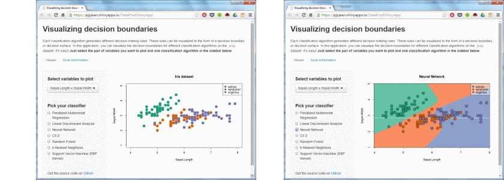

## A thousand words

* People say that [a picture is worth a thousand words](http://en.wikipedia.org/wiki/A_picture_is_worth_a_thousand_words).

* Each classification algorithm generates different decision making rules.

* With this [Shiny application](http://pjpjean.shinyapps.io/DataProdShinyApp/), you can visualize these rules in the form of beautiful decision boundaries plots.

---

## Dataset and models

* Plots are based on `iris` dataset, one of the best known datasets in pattern recognition literature.

* A collection of 7 popular classification algorithms.

|caret.id      |name                                |
|:-------------|:-----------------------------------|
|multinom      |Penalized Multinomial Regression    |
|lda           |Linear Discriminant Analysis        |
|nnet          |Neural Network                      |
|C5.0          |C5.0                                |
|rf            |Random Forest                       |
|knn           |k-Nearest Neighbors                 |
|svmRadialCost |Support Vector Machine (RBF Kernel) |

--- &twocol

## Example plots

Observe the differences between linear models and those that better captures non-linear relationships, like Random Forest.

*** =left

 

*** =right

 

--- &twocol

## More examples

See how SVMs with Radial Basis Function kernel try to maximize the distance from decision boundary
to the data points in a curved or circular-like way (hence the Radial).

*** =left

 

*** =right
 
